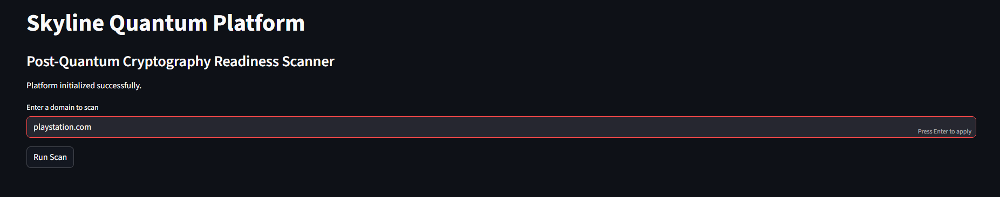

# Quantum



An AI-powered cybersecurity reconnaissance platform that analyzes an organization's public-facing security posture and generates professional PDF assessment reports.

## Features

- Company reconnaissance
- SSL/TLS analysis
- Risk scoring
- PDF report generation
- Streamlit web interface

## Tech Stack

- Python
- Streamlit
- ReportLab
- Requests
- BeautifulSoup
- SSL/TLS libraries

## Demo

Coming Soon

## Installation

```bash
pip install -r requirements.txt
streamlit run app.py
